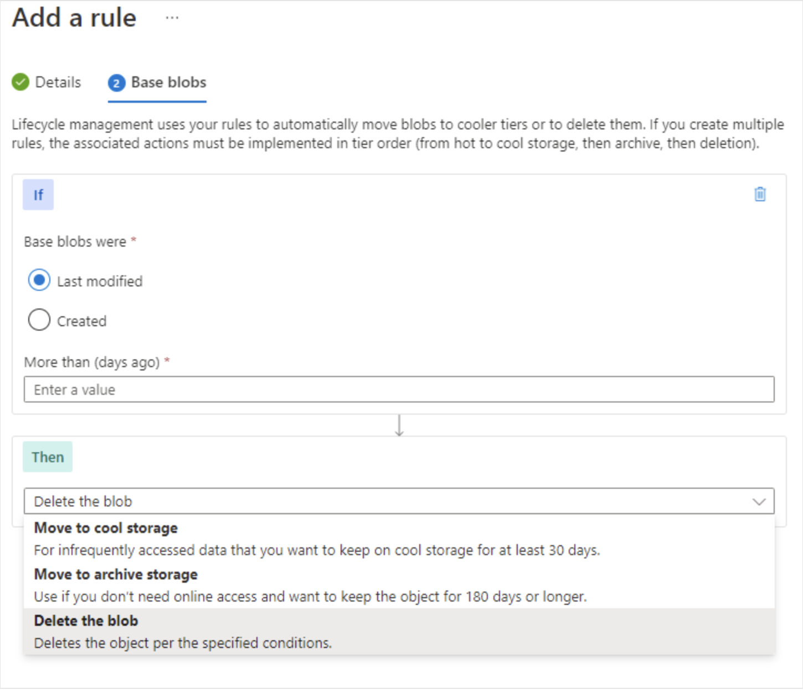

# Lifecycle management policy

Azure Storage lifecycle management offers a rule-based policy that you can use to transition blob data to the appropriate access tiers or to expire data at the end of the data lifecycle. A lifecycle policy acts on a base blob, and optionally on the blob's versions or snapshots. For more information about lifecycle management policies, see Optimize costs by automatically managing the data lifecycle.

A lifecycle management policy is composed of one or more rules that define a set of actions to take based on a condition being met. For a base blob, you can choose to check one of the following conditions:

- The number of days since the blob was created.
- The number of days since the blob was last modified.
- The number of days since the blob was last accessed. To use this condition in an action, you should first optionally enable last access time tracking.

When the selected condition is true, then the management policy performs the specified action. For example, if you have defined an action to move a blob from the hot tier to the cool tier if it has not been modified for 30 days, then the lifecycle management policy will move the blob 30 days after the last write operation to that blob.

For a blob snapshot or version, the condition that is checked is the number of days since the snapshot or version was created.

## Configure lifecycle management policy rules

In the Azure portal, you create lifecycle management policy rules for your Azure storage account by specifying several settings. For each rule, you create If - Then block conditions to transition or expire data based on your specifications. As you review these details, consider how you can set up lifecycle management policy rules for your data sets.

- If: The If clause sets the evaluation clause for the policy rule. When the If clause evaluates to true, the Then clause is executed. Use the If clause to set the time period to apply to the blob data. The lifecycle management feature checks if the data is accessed or modified according to the specified time.
  - More than (days ago): The number of days to use in the evaluation condition.

- Then: The Then clause sets the action clause for the policy rule. When the If clause evaluates to true, the Then clause is executed. Use the Then clause to set the transition action for the blob data. The lifecycle management feature transitions the data based on the setting.
  - Move to cool storage: The blob data is transitioned to Cool tier storage.
  - Move to archive storage: The blob data is transitioned to Archive tier storage.
  - Delete the blob: The blob data is deleted.

## Additional Information

- You can only change the access tier for Block Blobs, when trying to create a lifecycle for Append blobs you have only options related with  delete the objects.

>[!IMPORTANT]
>[Lifecycle Management](https://learn.microsoft.com/en-us/azure/storage/blobs/lifecycle-management-policy-configure)
<!-- MD028/no-blanks-blockquote -->
>[!NOTE]
>[Introduction](https://learn.microsoft.com/en-us/training/modules/configure-blob-storage/5-add-blob-lifecycle-management-rules)
>
>[manage Azure Blobs lifecycles](https://www.youtube.com/watch?v=-3k0hhngt7o)
