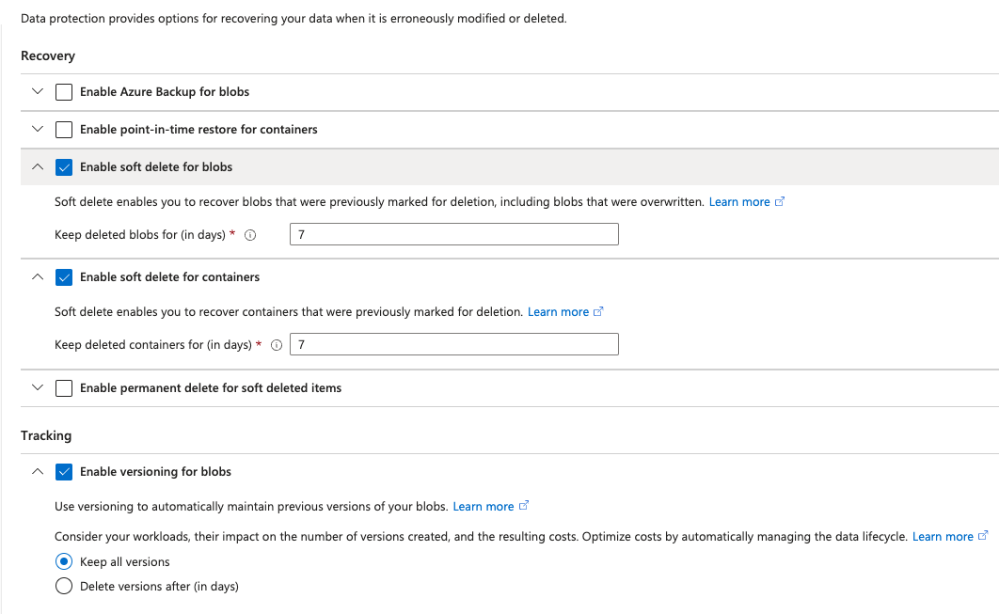

# Blob versioning

You can enable Blob storage versioning to automatically maintain previous versions of an object. When blob versioning is enabled, you can access earlier versions of a blob to recover your data if it's modified or deleted.

## Recommended data protection configuration

Blob versioning is part of a comprehensive data protection strategy for blob data. For optimal protection for your blob data, Microsoft recommends enabling all of the following **data protection** features:

- **Blob versioning**, to automatically maintain previous versions of a blob. When blob versioning is enabled, you can restore an earlier version of a blob to recover your data if it's erroneously modified or deleted. To learn how to enable blob versioning, see [Enable and manage blob versioning](https://learn.microsoft.com/en-us/azure/storage/blobs/versioning-enable).
- **Container soft delete**, to restore a container that has been deleted. To learn how to enable container soft delete, see [Enable and manage soft delete for containers](https://learn.microsoft.com/en-us/azure/storage/blobs/soft-delete-container-enable).
- **Blob soft delete**, to restore a blob, snapshot, or version that has been deleted. To learn how to enable blob soft delete, see [Enable and manage soft delete for blobs](https://learn.microsoft.com/en-us/azure/storage/blobs/soft-delete-blob-enable).
  - 

## Additional Information

- Blob versions are immutable. You can't modify the content or metadata of an existing blob version.
- Having a large number of versions per blob can increase the latency for blob listing operations. Microsoft recommends maintaining fewer than 1000 versions per blob. You can use lifecycle management to automatically delete old versions.

>[!IMPORTANT]
>[Manage Blob Versioning](https://learn.microsoft.com/en-us/azure/storage/blobs/versioning-enable)
<!-- MD028/no-blanks-blockquote -->
>[!NOTE]
>[Overview](https://learn.microsoft.com/en-us/azure/storage/blobs/versioning-overview)
