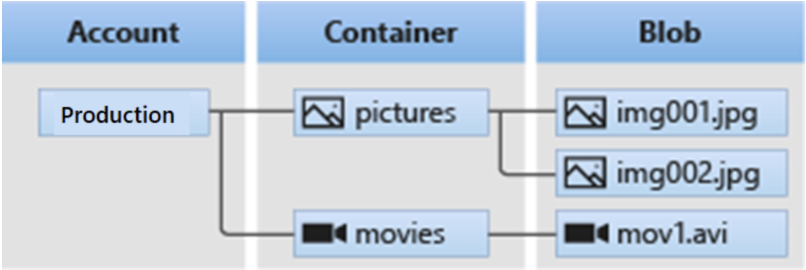
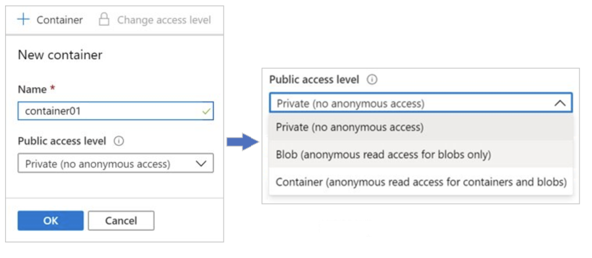

# Azure Blob Storage

Azure Blob Storage is a service that stores unstructured data in the cloud as objects or blobs. Blob stands for Binary Large Object. Blob Storage is also referred to as *object storage* or *container storage*. Unstructured data is data that doesn't adhere to a particular data model or definition, such as text or binary data.

## Things to know about Azure Blob Storage

Let's examine some configuration characteristics of Blob Storage.

- Blob Storage can store any type of text or binary data. Some examples are text documents, images, video files, and application installers.

- Blob Storage uses three resources to store and manage your data:
  - An Azure storage account
  - Containers in an Azure storage account
  - Blobs in a container

- To implement Blob Storage, you configure several settings:
  - Blob container options
  - Blob types and upload options
  - Blob Storage access tiers
  - Blob lifecycle rules
  - Blob object replication options

The following diagram shows the relationship between the Blob Storage resources.

## Things to consider when implementing Azure Blob Storage

There are many common uses for Blob Storage. Consider the following scenarios and think about your own data needs:

- **Consider browser uploads.** Use Blob Storage to serve images or documents directly to a browser.
- **Consider distributed access.** Blob Storage can store files for distributed access, such as during an installation process.
- **Consider streaming data.** Stream video and audio by using Blob Storage.
- **Consider archiving and recovery.** Blob Storage is a great solution for storing data for backup and restore, disaster recovery, and archiving.
- **Consider application access.** You can store data in Blob Storage for analysis by an on-premises or Azure-hosted service.

## Create blob containers

Azure Blob Storage uses a container resource to group a set of blobs. A blob can't exist by itself in Blob Storage. A blob must be stored in a container resource.

### Things to know about containers and blobs

Let's look at the configuration characteristics of containers and blobs.

- All blobs must be in a container.
- A container can store an unlimited number of blobs.
- An Azure storage account can contain an unlimited number of containers.
- You can create the container in the Azure portal.
- You upload blobs into a container.

### Configure a container

A container organizes a set of blobs, similar to a directory in a file system. A storage account can include an unlimited number of containers, and a container can store an unlimited number of blobs.

In the Azure portal, you configure two settings to create a container for an Azure storage account. As you review these details, consider how you might organize containers in your storage account.

- Name: Enter a name for your container. The name must be unique within the Azure storage account.
  - The name can contain only lowercase letters, numbers, and hyphens.
  - The name must begin with a letter or a number.
  - The minimum length for the name is three characters.
  - The maximum length for the name is 63 characters.

- Public access level: The access level specifies whether the container and its blobs can be accessed publicly. By default, container data is private and visible only to the account owner. There are three access level choices:
  - Private: (Default) Prohibit anonymous access to the container and blobs.
  - Blob: Allow anonymous public read access for the blobs only.
  - Container: Allow anonymous public read and list access to the entire container, including the blobs.

### Blobs

Azure Storage supports three types of blobs:

- Block blobs store text and binary data. Block blobs are made up of blocks of data that can be managed individually. Block blobs can store up to about 190.7 TiB.
- Append blobs are made up of blocks like block blobs, but are optimized for append operations. Append blobs are ideal for scenarios such as logging data from virtual machines.
- Page blobs store random access files up to 8 TiB in size. Page blobs store virtual hard drive (VHD) files and serve as disks for Azure virtual machines. For more information about page blobs, see Overview of Azure page blobs

>[!TIP]
>You can also create a blob container with PowerShell by using the `New-AzStorageContainer` command.
<!-- MD028/no-blanks-blockquote -->
>[!NOTE]
>[Introduction](https://learn.microsoft.com/en-us/azure/storage/blobs/storage-blobs-introduction)
>
>[Overview](https://learn.microsoft.com/en-gb/training/modules/configure-blob-storage/2-implement)
>
>[Move content between containers](https://www.youtube.com/watch?v=S3TXW4UrSak)
