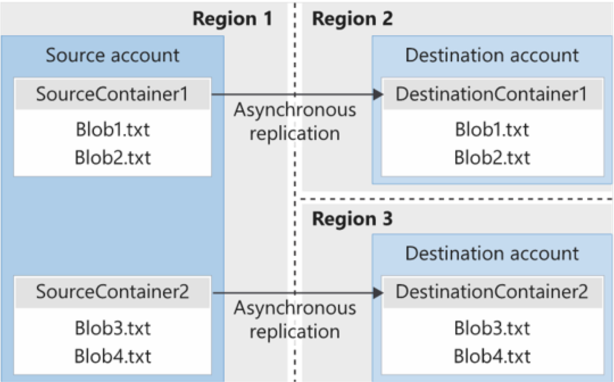

# Blob object replication

Object replication copies blobs in a container **asynchronously** according to policy rules that you configure. During the replication process, the following contents are copied from the source container to the destination container:

- The blob contents
- The blob metadata and properties
- Any versions of data associated with the blob

The following illustration shows an example of asynchronous replication of blob containers between regions.

## Things to know about blob object replication

There are several considerations to keep in mind when planning your configuration for blob object replication.

- Object replication requires that blob versioning is enabled on both the source and destination accounts.
- Object replication doesn't support blob snapshots. Any snapshots on a blob in the source account aren't replicated to the destination account.
- Object replication is supported when the source and destination accounts are in the Hot, Cool, or Cold tier. The source and destination accounts can be in different tiers.
- When you configure object replication, you create a replication policy that specifies the source Azure storage account and the destination storage account.
- A replication policy includes one or more rules that specify a source container and a destination container. The policy identifies the blobs in the source container to replicate.

## Configure object replication using a JSON file

If you don't have permissions to the source storage account or if you want to use more than 10 container pairs, then you can configure object replication on the destination account and provide a JSON file that contains the policy definition to another user to create the same policy on the source account. For example, if the source account is in a different Microsoft Entra tenant from the destination account, then you can use this approach to configure object replication.

## Things to consider when configuring blob object replication

There are many benefits to using blob object replication. Consider the following scenarios and think about how replication can be a part of your Blob Storage strategy.

- **Consider latency reductions.** Minimize latency with blob object replication. You can reduce latency for read requests by enabling clients to consume data from a region that's in closer physical proximity.
- **Consider efficiency for compute workloads.** Improve efficiency for compute workloads by using blob object replication. With object replication, compute workloads can process the same sets of blobs in different regions.
- **Consider data distribution.** Optimize your configuration for data distribution. You can process or analyze data in a single location and then replicate only the results to other regions.
- **Consider costs benefits.** Manage your configuration and optimize your storage policies to achieve cost benefits. After your data is replicated, you can reduce costs by moving the data to the Archive tier by using lifecycle management policies.

>[!IMPORTANT]
>[Hot to Configure Object Replication](https://learn.microsoft.com/en-us/azure/storage/blobs/object-replication-configure)
<!-- MD028/no-blanks-blockquote -->
>[!NOTE]
>[Introduction](https://learn.microsoft.com/en-us/training/modules/configure-blob-storage/6-determine-blob-object-replication)
