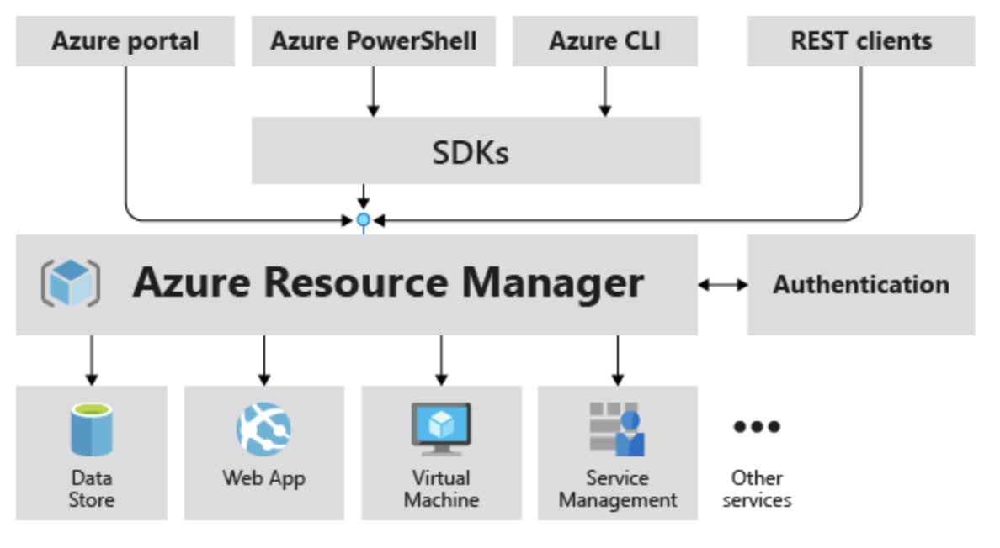

# What is?

Azure Resource Manager is the deployment and management service for Azure. It provides a management layer that enables you to create, update, and delete resources in your Azure account. You use management features, like access control, locks, and tags, to secure and organize your resources after deployment.

When you send a request through any of the Azure APIs, tools, or SDKs, Resource Manager receives the request. It authenticates and authorizes the request before forwarding it to the appropriate Azure service. Because all requests are handled through the same API, you see consistent results and capabilities in all the different tools.

The following image shows the role Azure Resource Manager plays in handling Azure requests.

- On the Azure portal, you interact directly with the individual services and resources (like virtual machines, databases, storage accounts, etc.) that ARM manages, but you're leveraging ARM's capabilities behind the scenes to manage and orchestrate those resources efficiently.
- ARM template - A JavaScript Object Notation (JSON) file that defines one or more resources to deploy to a resource group, subscription, management group, or tenant. The template can be used to deploy the resources consistently and repeatedly. See [Template deployment overview](https://learn.microsoft.com/en-us/azure/azure-resource-manager/templates/overview).
- Bicep file - A file for declaratively deploying Azure resources. [Bicep](../Extras/What%20is%20bicep.md) is a language that was designed to provide the best authoring experience for infrastructure as code solutions in Azure. Bicep offers the same capabilities as ARM templates but with a syntax that's easier to use. Each Bicep file is automatically converted to an ARM template during deployment.
- **ARM templates are idempotent, which means you can deploy the same template many times and get the same resource types in the same state.**

The Azure Resource Manager service is designed for resiliency and continuous availability. Resource Manager and control plane operations (requests sent to management.azure.com) in the REST API are:

- Distributed across regions. Azure Resource Manager has a separate instance in each region of Azure, meaning that a failure of the Azure Resource Manager instance in one region doesn't affect the availability of Azure Resource Manager or other Azure services in another region.
- Distributed across Availability Zones (and regions) in locations that have multiple Availability Zones. This distribution ensures that when a region loses one or more zones, Azure Resource Manager can either fail over to another zone or to another region to continue to provide control plane capability for the resources.
- Not dependent on a single logical data center.
- Never taken down for maintenance activities.

>[!TIP]
> [ARM](https://learn.microsoft.com/en-us/azure/azure-resource-manager/management/overview)
