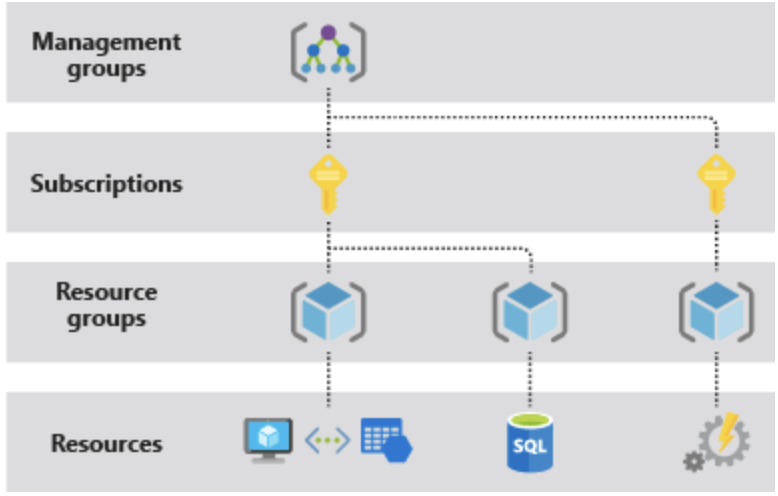

# Management Scope

Azure provides four levels of management scope: management groups, subscriptions, resource groups, and resources. The following image shows an example of these layers.

You apply management settings at any of these levels of scope. The level you select determines how widely the setting is applied. Lower levels inherit settings from higher levels. For example, when you apply a policy to the subscription, the policy is applied to all resource groups and resources in your subscription. When you apply a policy on the resource group, that policy is applied to the resource group and all its resources. However, another resource group doesn't have that policy assignment.

>[!NOTE]
>[Understand Scope](https://learn.microsoft.com/en-us/azure/azure-resource-manager/management/overview#understand-scope)
