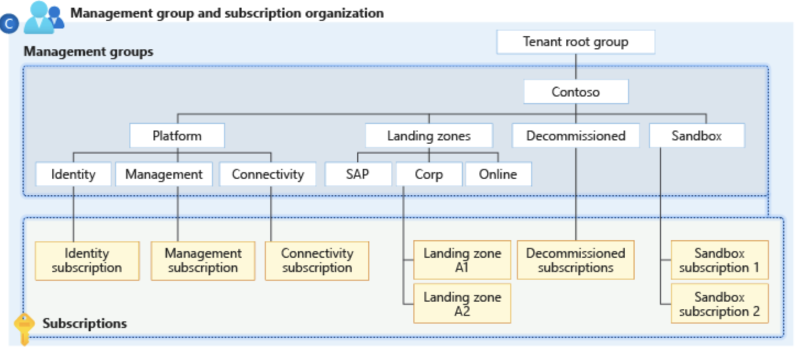

# What is?

If your organization has many Azure subscriptions, you may need a way to efficiently manage access, policies, and compliance for those subscriptions. Management groups provide a governance scope above subscriptions. You organize subscriptions into management groups; the governance conditions you apply cascade by inheritance to all associated subscriptions.

Management groups give you enterprise-grade management at scale, no matter what type of subscriptions you might have. However, all subscriptions within a single management group must trust the same Azure Active Directory (Azure AD) tenant.

For example, you can apply policies to a management group that limits the regions available for virtual machine (VM) creation. This policy would be applied to all nested management groups, subscriptions, and resources and allow VM creation only in authorized regions.

## Hierarchy of management groups and subscriptions

You can build a flexible structure of management groups and subscriptions to organize your resources into a hierarchy for unified policy and access management. The following diagram shows an example of creating a hierarchy for governance using management groups.

- 10,000 management groups can be supported in a single directory.
- A management group tree can support up to six levels of depth.
  - This limit doesn't include the Root level or the subscription level.
- Each management group and subscription can only support one parent.
- Each management group can have many children.
- All subscriptions and management groups are within a single hierarchy in each directory.
- By default, the root management group's display name is Tenant root group and operates itself as a management group. The ID is the same value as the Azure Active Directory (Azure AD) tenant ID.
- The root management group can't be moved or deleted, unlike other management groups.

>[!TIP]
>[Management Groups](https://learn.microsoft.com/en-us/azure/governance/management-groups/overview)
>
>[Create Management Groups](https://learn.microsoft.com/en-us/azure/governance/management-groups/create-management-group-portal?source=recommendations)
