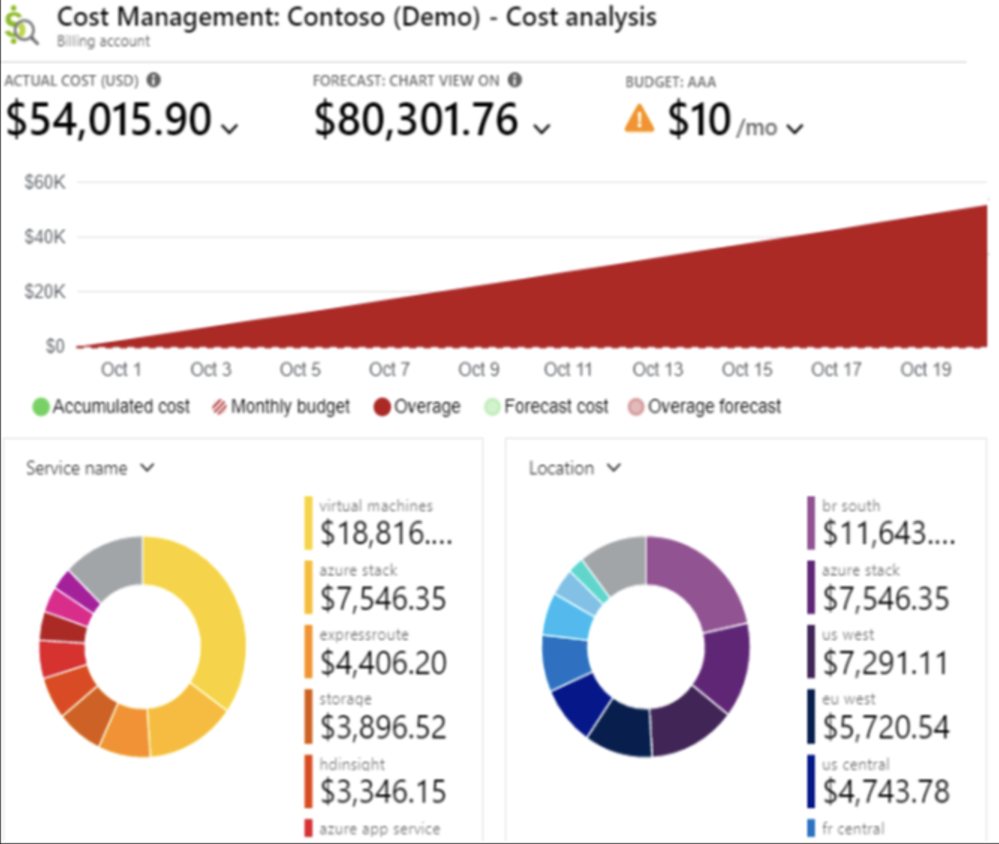

# Implement Microsoft Cost Management

With Azure products and services, you pay only for what you use. As you create and use Azure resources, you're charged for the resources.

**Microsoft Cost Management provides support for administrative billing tasks and helps you manage billing access to costs.** You can use the product to monitor and control Azure spending, and optimize your Azure resource usage.

## Cost Analysis

Before you can control and optimize your costs, you first need to understand where they originated – from the underlying resources used to support your cloud projects to the environments they're deployed in and the owners who manage them. Full visibility backed by a thorough tagging strategy is critical to accurately understand your spending patterns and enforce cost control mechanisms.

Cost analysis is your tool for interactive analytics and insights. It should be your first stop when you need to explore or get quick answers about your costs. You explore and analyze costs using views. A view is a customizable report that summarizes and allows you to drill into your costs. Cost analysis comes with various built-in views that summarize:

- Cost of your resources at various levels.
- Overarching services spanning all your resources.
- Amortized reservation usage.
- Cost trends over time.

At your subscription/resource group page on cost analysis you can see the costs agreagated by service, location and service group, you can check your budget and forecast.

## Cost alerts

Empowers you to set up alerts tailored to specific thresholds. You have the flexibility to establish a budget, but even if your project lacks one, you can still configure alerts based on anomalies. These anomalies, defined by Azure, don't require you to set up an action group for anomaly detection; simply provide your email, and you're all set. An anomaly is characterized as a novel charge not present the previous day, charges that were ongoing but ceased, or notable changes, whether increases or decreases, in costs.
PS: Latest versions to create a alert based on budget you have to go into budget page.

## Budget

Budgets in Cost Management help you plan for and drive organizational accountability. They help you proactively inform others about their spending to manage costs and monitor how spending progresses over time.

You can configure alerts based on your actual cost or forecasted cost to ensure that your spending is within your organizational spending limit. Notifications are triggered when the budget thresholds are exceeded. Resources aren't affected, and your consumption isn't stopped. You can use budgets to compare and track spending as you analyze costs.

Cost and usage data is typically available within 8-24 hours and budgets are evaluated against these costs every 24 hours. Be sure to get familiar with [Cost and usage data updates](https://learn.microsoft.com/en-us/azure/cost-management-billing/costs/understand-cost-mgt-data#cost-and-usage-data-updates-and-retention) specifics. When a budget threshold is met, email notifications are normally sent within an hour of the evaluation.

Budgets reset automatically at the end of a period (monthly, quarterly, or annually) for the same budget amount when you select an expiration date in the future. Because they reset with the same budget amount, you need to create separate budgets when budgeted currency amounts differ for future periods. When a budget expires, it automatically gets deleted.

When you create or edit a budget for a subscription or resource group scope, you can configure it to call an [action group](https://learn.microsoft.com/en-us/azure/azure-monitor/alerts/action-groups). The action group can perform various actions when your budget threshold is met. You can receive mobile push notifications when your budget threshold is met by enabling Azure app push notifications while configuring the action group.

Action groups are currently only supported for subscription and resource group scopes. For more information about creating action groups, see action groups.

## Advisor

Advisor is a digital cloud assistant that helps you follow best practices to optimize your Azure deployments. It analyzes your resource configuration and usage telemetry and then recommends solutions that can help you improve the cost effectiveness, performance, reliability, and security of your Azure resources.

With Advisor, you can:

- Get proactive, actionable, and personalized best practices recommendations.
- Improve the performance, security, and reliability of your resources, as you identify opportunities to reduce your overall Azure spend.
- Get recommendations with proposed actions inline.

The Advisor dashboard displays personalized recommendations for all your subscriptions. The recommendations are divided into five categories:

- **Reliability**: To ensure and improve the continuity of your business-critical applications. For more information, see Advisor Reliability recommendations.
- **Security**: To detect threats and vulnerabilities that might lead to security breaches. For more information, see Advisor Security recommendations.
- **Performance**: To improve the speed of your applications. For more information, see Advisor Performance recommendations.
- **Cost**: To optimize and reduce your overall Azure spending. For more information, see Advisor Cost recommendations.
- **Operational Excellence**: To help you achieve process and workflow efficiency, resource manageability and deployment best practices. For more information, see Advisor Operational Excellence recommendations.

- Constantly run on your account and make recomendation, cost is one of these categories helping you make savings.
- There is also a service called [Cost management](https://learn.microsoft.com/en-us/azure/cost-management-billing/cost-management-billing-overview) in which you can see all budgets from subscriptions and resource groups in just one place.

>[!NOTE]
>[Implemente Cost Management](https://learn.microsoft.com/en-us/training/modules/configure-subscriptions/6-implement-cost-management)
>
>[Cost Analysis](https://learn.microsoft.com/en-us/azure/cost-management-billing/costs/quick-acm-cost-analysis)
>
>[Create budgets](https://learn.microsoft.com/en-us/azure/cost-management-billing/costs/tutorial-acm-create-budgets)
>
>[Advisor Overview](https://learn.microsoft.com/en-us/azure/advisor/advisor-overview)
>
>[Use cost alerts to monitor usage and spending](https://learn.microsoft.com/en-us/azure/cost-management-billing/costs/cost-mgt-alerts-monitor-usage-spending)
