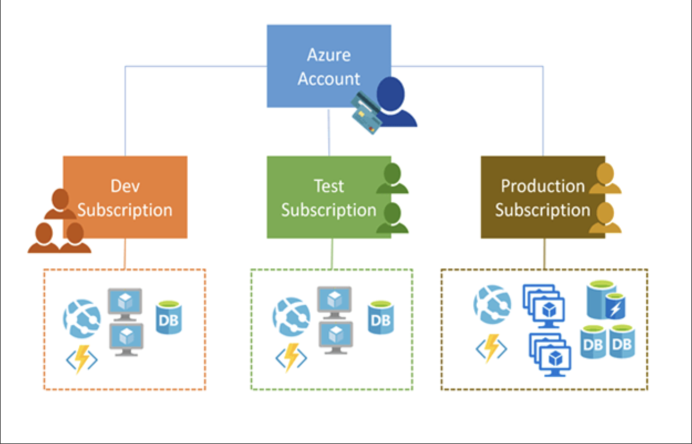

# Azure subscriptions

An Azure subscription is a logical unit of Azure services that's linked to an Azure account. An Azure account is an identity in Microsoft Entra ID or a directory that's trusted by Microsoft Entra ID, such as a work or school account. Subscriptions help you organize access to Azure cloud service resources, and help you control how resource usage is reported, billed, and paid.

All Azure subscriptions have a trust relationship with a Microsoft Entra tenant. Subscriptions rely on this tenant (directory) to authenticate and authorize security principals and devices. When a subscription expires, the trusted instance remains, but the security principals lose access to Azure resources. Subscriptions can only trust a single directory while one Microsoft Entra tenant may be trusted by multiple subscriptions.

When a user signs up for a Microsoft cloud service, a new Microsoft Entra tenant is created and the user is made a Global Administrator. However, when an owner of a subscription joins their subscription to an existing tenant, the owner isn't assigned to the Global Administrator role.

While users may only have a single authentication home directory, users may participate as guests in multiple directories. You can see both the home and guest directories for each user in Microsoft Entra ID.

## Additional Information

- A subscription in Azure is both a billing entity and a security boundary.
- Every Azure cloud service belongs to a subscription.
- Each subscription can have a different billing and payment configuration.
- Multiple subscriptions can be linked to the same Azure account.
- Types of subscription includes: Enterprise agreement, Microsoft reseller, Microsoft partner, Personal free account.
- You can move your subscription to another tenant by clicking at `change directory` at  subscription overview page.
- Subscriptions are not tied to an Azure Region and as a result can contain resources from any number of Regions.

>[!NOTE]
>[Understanding Tenants, Subscriptions, Regions and Geographies in Azure](https://blog.siliconvalve.com/posts/2018/08/27/understanding-tenants-subscriptions-regions-and-geographies-in-azure)
>
>[Azure Subscription](https://learn.microsoft.com/en-us/training/modules/configure-subscriptions/3-implement-azure-subscriptions)
>
>[Resource Providers](https://learn.microsoft.com/en-us/azure/azure-resource-manager/management/resource-providers-and-types)
>
>[Associate or add an Azure subscription](https://learn.microsoft.com/en-us/entra/fundamentals/how-subscriptions-associated-directory)
