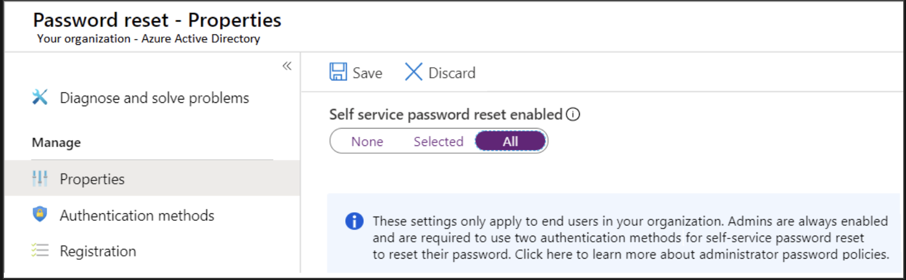

# Microsoft Entra self-service password reset

The Microsoft Entra self-service password reset (SSPR) feature lets you give users the ability to bypass helpdesk and reset their own passwords.

## Things to consider when using SSPR

Your organization wants to implement support for SSPR in their management solution. As you plan for your configuration, review the following points:

- Consider who can reset their passwords. Decide which users in your organization should be enabled to use the feature. In the Azure portal, there are three options for the SSPR feature: None, Selected, and All.

The Selected option is useful for creating specific groups who have SSPR enabled. You can create groups for testing or proof of concept before applying the feature to a larger group. When you're ready to deploy SSPR to all user accounts in your Microsoft Entra tenant, you can change the setting.

## Configure SSPR

Go to the Azure portal, go to `Microsoft Entra ID` > `Password reset`.

## Additional Information

- Any user who is signed in can change their password, regardless of the edition of Microsoft Entra ID.
- If you're not signed in and you've forgotten your password or your password has expired, you can use SSPR in Microsoft Entra ID P1 or P2. It's also available with Microsoft 365 Apps for business or Microsoft 365.

>[!NOTE]
>[Overview](https://learn.microsoft.com/en-us/training/modules/allow-users-reset-their-password/2-self-service-password-reset)
>
>[Implement Self Service Password Reset](https://learn.microsoft.com/en-us/training/modules/configure-azure-active-directory/6-implement-self-service-password-reset)
