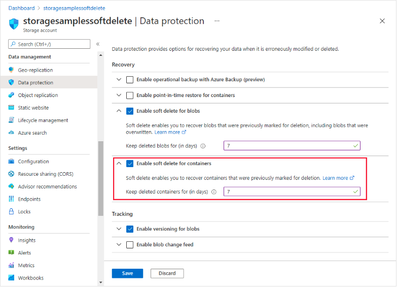

# Data protection overview

Azure Storage provides data protection for Blob Storage and Azure Data Lake Storage Gen2 to help you to prepare for scenarios where you need to recover data that has been deleted or overwritten. It's important to think about how to best protect your data before an incident occurs that could compromise it.

## Overview of data protection options

|Scenario|Data protection option|Recommendations|Protection benefit|
|-|-|-|-|
|Restore a deleted container within a specified interval.|Container soft delete|Enable container soft delete for all storage accounts, with a minimum retention interval of seven days. Enable blob versioning and blob soft delete together with container soft delete to protect individual blobs in a container. Store containers that require different retention periods in separate storage accounts.|A deleted container and its contents may be restored within the retention period. Only container-level operations (for example, Delete Container) can be restored. Container soft delete doesn't enable you to restore an individual blob in the container if that blob is deleted.|
|Restore a deleted blob or blob version within a specified interval.|Blob soft delete|Enable blob soft delete for all storage accounts, with a minimum retention interval of seven days. Enable blob versioning and container soft delete together with blob soft delete for optimal protection of blob data Store blobs that require different retention periods in separate storage accounts.|A deleted blob or blob version may be restored within the retention period.||
|Manually save the state of a blob at a given point in time.|Blob snapshot|Recommended as an alternative to blob versioning when versioning isn't appropriate for your scenario, due to cost or other considerations, or when the storage account has a hierarchical namespace enabled.|A blob may be restored from a snapshot if the blob is overwritten. If the blob is deleted, snapshots are also deleted.|
|Automatically save the state of a blob in a previous version when it's overwritten.|Blob versioning|Enable blob versioning, together with container soft delete and blob soft delete, for storage accounts where you need optimal protection for blob data. Store blob data that doesn't require versioning in a separate account to limit costs.|Every blob write operation creates a new version. The current version of a blob may be restored from a previous version if the current version is deleted or overwritten.|

## Soft delete for containers

Container soft delete protects your data from being accidentally deleted by maintaining the deleted data in the system for a specified period of time. During the retention period, you can restore a soft-deleted container and its contents to the container's state at the time it was deleted. After the retention period has expired, the container and its contents are permanently deleted.

### How container soft delete works

When you enable container soft delete, you can specify a retention period for deleted containers that is between 1 and 365 days. The default retention period is seven days. During the retention period, you can recover a deleted container by calling the Restore Container operation.

When you restore a container, the container's blobs and any blob versions and snapshots are also restored. However, you can only use container soft delete to restore blobs if the container itself was deleted. To a restore a deleted blob when its parent container hasn't been deleted, you must use blob soft delete or blob versioning.

>[!IMPORTANT]
Container soft delete can restore only whole containers and their contents at the time of deletion. You cannot restore a deleted blob within a container by using container soft delete. Microsoft recommends also enabling blob soft delete and blob versioning to protect individual blobs in a container.
<!-- MD028/no-blanks-blockquote -->

When you restore a container, you must restore it to its original name. If the original name has been used to create a new container, then you will not be able to restore the soft-deleted container.

## Enable container soft delete

You can enable or disable container soft delete for the storage account at any time by using the Azure portal, PowerShell, Azure CLI, or an Azure Resource Manager template. Microsoft recommends setting the retention period for container soft delete to a minimum of seven days.

## Soft delete for blobs

Blob soft delete protects an individual blob, snapshot, or version from accidental deletes or overwrites by maintaining the deleted data in the system for a specified period of time. During the retention period, you can restore a soft-deleted object to its state at the time it was deleted. After the retention period has expired, the object is permanently deleted.

### How blob soft delete works

When you enable blob soft delete for a storage account, you specify a retention period for deleted objects of between 1 and 365 days. The retention period indicates how long the data remains available after it's deleted or overwritten. The clock starts on the retention period as soon as an object is deleted or overwritten.

While the retention period is active, you can restore a deleted blob, together with its snapshots, or a deleted version by calling the Undelete Blob operation.

### How deletions are handled when soft delete is enabled

When blob soft delete is enabled, deleting a blob marks that blob as soft-deleted. No snapshot is created. When the retention period expires, the soft-deleted blob is permanently deleted. In accounts that have a hierarchical namespace, the access control list of a blob is unaffected and will remain intact if the blob is restored.

If a blob has snapshots, the blob can't be deleted unless the snapshots are also deleted. When you delete a blob and its snapshots, both the blob and snapshots are marked as soft-deleted. No new snapshots are created.

You can also delete one or more active snapshots without deleting the base blob. In this case, the snapshot is soft-deleted.

If a directory is deleted in an account that has the hierarchical namespace feature enabled on it, the directory and all its contents are marked as soft-deleted. Only the soft-deleted directory can be accessed. In order to access the contents of the soft-deleted directory, the soft-deleted directory needs to be undeleted first.

Soft-deleted objects are invisible unless they're explicitly displayed or listed.

## Blob snapshots

A snapshot is a read-only version of a blob that's taken at a point in time.

>[!IMPORTANT]
Blob versioning offers a superior way to maintain previous versions of a blob. For more information, see [Blob versioning.](https://learn.microsoft.com/en-us/azure/storage/blobs/versioning-overview)
<!-- MD028/no-blanks-blockquote -->

## About blob snapshots

A snapshot of a blob is identical to its base blob, except that the blob URI has a DateTime value appended to the blob URI to indicate the time at which the snapshot was taken. For example, if a page blob URI is `http://storagesample.core.blob.windows.net/mydrives/myvhd`, the snapshot URI is similar to `http://storagesample.core.blob.windows.net/mydrives/myvhd?snapshot=2011-03-09T01:42:34.9360000Z`.

>[!IMPORTANT]
All snapshots share the base blob's URI. The only distinction between the base blob and the snapshot is the appended DateTime value.
<!-- MD028/no-blanks-blockquote -->

A blob can have any number of snapshots. Snapshots persist until they're explicitly deleted, either independently or as part of a Delete Blob operation for the base blob. You can enumerate the snapshots associated with the base blob to track your current snapshots.

When you create a snapshot of a blob, the blob's system properties are copied to the snapshot with the same values. The base blob's metadata is also copied to the snapshot, unless you specify separate metadata for the snapshot when you create it. After you create a snapshot, you can read, copy, or delete it, but you can't modify it.

Any leases associated with the base blob don't affect the snapshot. You can't acquire a lease on a snapshot.

You can create a snapshot of a blob in the hot or cool tier. Snapshots on blobs in the archive tier aren't supported.

A VHD file is used to store the current information and status for a VM disk. You can detach a disk from within the VM or shut down the VM, and then take a snapshot of its VHD file. You can use that snapshot file later to retrieve the VHD file at that point in time and recreate the VM.

## Prevent accidental deletion of Azure file shares

Azure Files offers soft delete for SMB file shares. Soft delete allows you to recover your file share when it is mistakenly deleted by an application or other storage account user.

### Enabling or disabling soft delete

Soft delete for file shares is enabled at the storage account level, because of this, the soft delete settings apply to all file shares within a storage account. Soft delete is enabled by default for new storage accounts and can be disabled or enabled at any time. Soft delete is not automatically enabled for existing storage accounts unless Azure file share backup was configured for a Azure file share in that storage account. If Azure file share backup was configured, then soft delete for Azure file shares are automatically enabled on that share's storage account.

If you enable soft delete for file shares, delete some file shares, and then disable soft delete, if the shares were saved in that period you can still access and recover those file shares. When you enable soft delete, you also need to configure the retention period.

## Additional Information

- After you enable blob versioning for a storage account, every write operation to a blob in that account results in the creation of a new version. For this reason, enabling blob versioning may result in additional costs. To minimize costs, use a lifecycle management policy to automatically delete old versions. For more information about lifecycle management, see Optimize costs by automating Azure Blob Storage access tiers.
- See also [versioning](./Configure%20blob%20versioning.md)

>[!NOTE]
>[Data Protection Overview](https://learn.microsoft.com/en-us/azure/storage/blobs/data-protection-overview)
>
>[Soft Delete](https://learn.microsoft.com/en-us/azure/storage/blobs/soft-delete-container-overview)
>
>[Snapshot Overview](https://learn.microsoft.com/en-us/azure/storage/blobs/snapshots-overview)
>
>[Prevent Deletion Azure file shares](https://learn.microsoft.com/en-us/azure/storage/files/storage-files-prevent-file-share-deletion)
