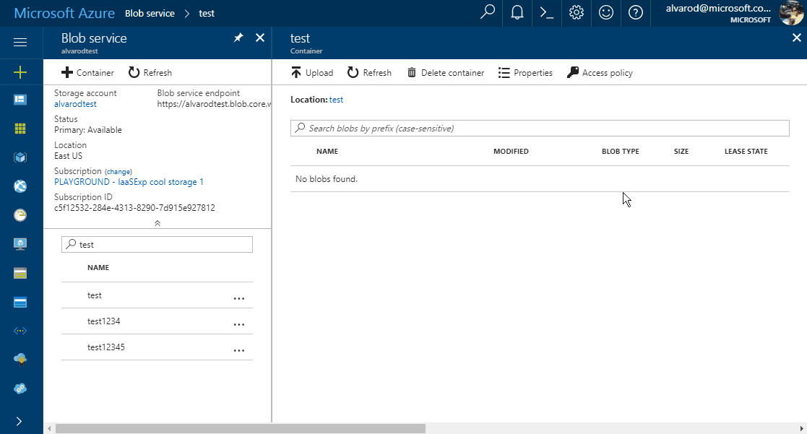

# Define a stored access policy

A stored access policy provides an additional level of control over service-level shared access signatures (SASs) on the server side. Establishing a stored access policy serves to group shared access signatures and to provide additional restrictions for signatures that are bound by the policy.

**You can use a stored access policy to change the start time, expiry time, or permissions for a signature. You can also use a stored access policy to revoke a signature after it has been issued.**

The following storage resources support stored access policies:

- Blob containers
- File shares
- Queues
- Tables

## Manage stored access policies for storage accounts from within the Azure portal

## Additional Information

- When you create or update a stored access policy on a container, table, queue, or share, the change might take up to 30 seconds to take effect. During this interval, requests against a shared access signature that's associated with the stored access policy might fail with status code 403 (Forbidden), until the access policy becomes active.

>[!NOTE]
>[Define a stored access policy](https://learn.microsoft.com/en-us/rest/api/storageservices/define-stored-access-policy)
>
>[Manage stored access policies for storage accounts from within the Azure portal](https://azure.microsoft.com/en-us/updates/manage-stored-access-policies-for-storage-accounts-from-within-the-azure-portal/)
