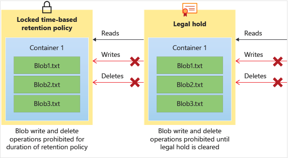

# Store business-critical blob data with immutable storage in a write once, read many (WORM) state

Immutable storage for Azure Blob Storage enables users to store business-critical data in a WORM (Write Once, Read Many) state. While in a WORM state, data can't be modified or deleted for a user-specified interval. By configuring immutability policies for blob data, you can protect your data from overwrites and deletes.

Immutable storage for Azure Blob Storage supports two types of immutability policies:

- Time-based retention policies: With a time-based retention policy, users can set policies to store data for a specified interval. When a time-based retention policy is set, objects can be created and read, but not modified or deleted. After the retention period has expired, objects can be deleted but not overwritten.

- Legal hold policies: A legal hold stores immutable data until the legal hold is explicitly cleared. When a legal hold is set, objects can be created and read, but not modified or deleted.

These policies can be set at the same time as one another. For example, a user can have both a time-based retention policy and a legal hold set at the same level and at the same time. In order for a write to succeed, you must either have versioning enabled or have neither a legal hold or time-based retention policy on the data. In order for a delete to succeed, there must not be a legal hold or time-based retention policy on the data as well.

The following diagram shows how time-based retention policies and legal holds prevent write and delete operations while they are in effect.

## Additional Information

- To enable immutable storage go into your container and select `Access policy` option.

<!-- MD028/no-blanks-blockquote -->
>[!NOTE]
>[Immutable Storage](https://learn.microsoft.com/en-us/azure/storage/blobs/immutable-storage-overview)
