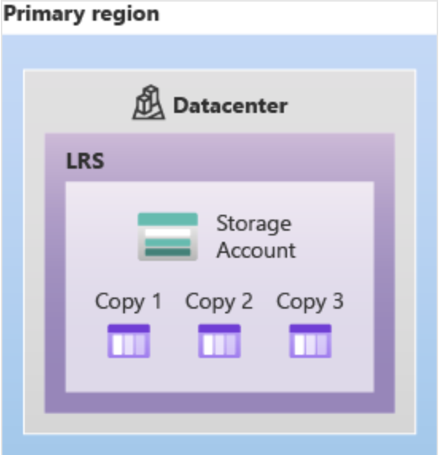
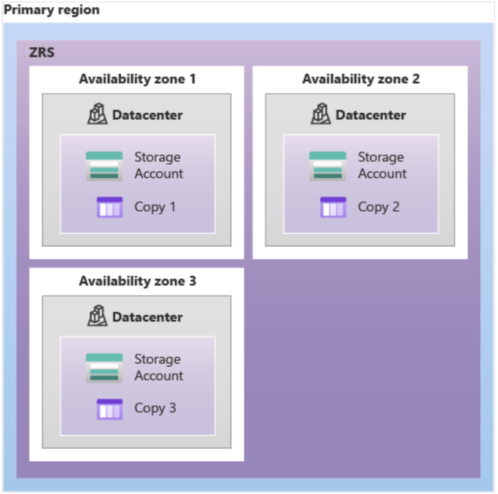
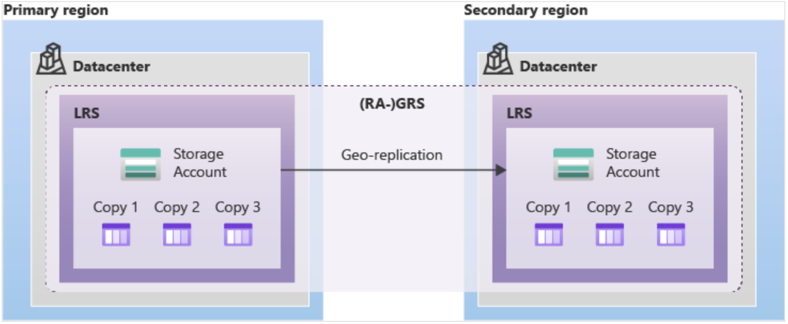
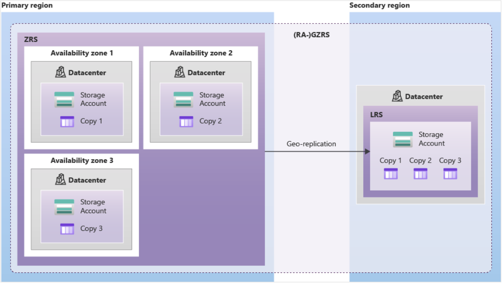

# Azure Storage redundancy

Azure Storage always stores multiple copies of your data so that it's protected from planned and unplanned events, including transient hardware failures, network or power outages, and massive natural disasters. Redundancy ensures that your storage account meets its availability and durability targets even in the face of failures.

## Redundancy in the primary region

Data in an Azure Storage account is always replicated three times in the primary region. Azure Storage offers two options for how your data is replicated in the primary region:

- Locally redundant storage (LRS) copies your data synchronously three times within a single physical location in the primary region. LRS is the least expensive replication option, but isn't recommended for applications requiring high availability or durability.
  - 

- Zone-redundant storage (ZRS) copies your data synchronously across three Azure availability zones in the primary region. For applications requiring high availability, Microsoft recommends using ZRS in the primary region, and also replicating to a secondary region.
  - 

## Redundancy in a secondary region

For applications requiring high durability, you can choose to additionally copy the data in your storage account to a secondary region that is hundreds of miles away from the primary region. If your storage account is copied to a secondary region, then your data is durable even in the case of a complete regional outage or a disaster in which the primary region isn't recoverable.

**When you create a storage account, you select the primary region for the account. The paired secondary region is determined based on the primary region, and can't be changed.**

- Geo-redundant storage (GRS) copies your data synchronously three times within a single physical location in the primary region using LRS. It then copies your data asynchronously to a single physical location in the secondary region. Within the secondary region, your data is copied synchronously three times using LRS.
  - 

- Geo-zone-redundant storage (GZRS) copies your data synchronously across three Azure availability zones in the primary region using ZRS. It then copies your data asynchronously to a single physical location in the secondary region. Within the secondary region, your data is copied synchronously three times using LRS.
  - 

## Additional Information

- ZRS isn't currently available in all regions.
- GRS and GZRS offers durability for storage resources of at least 99.99999999999999% (16 9's) over a given year.

>[!NOTE]
>[Storage Redundancy](https://learn.microsoft.com/en-us/azure/storage/common/storage-redundancy)
>
>[Redundancy Migration](https://learn.microsoft.com/en-us/azure/storage/common/redundancy-migration)
