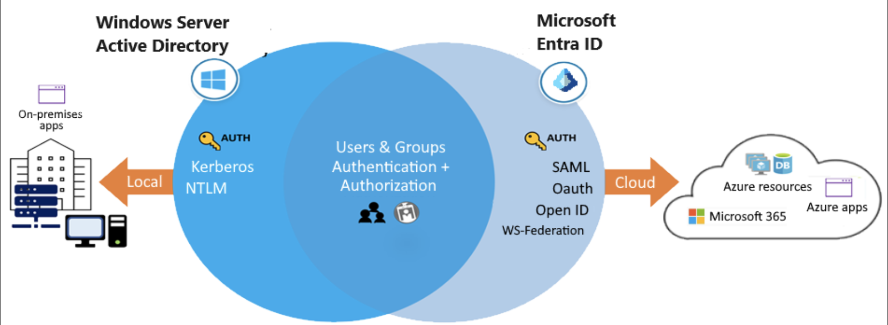

# What is Microsoft Entra ID?

Microsoft Entra ID is Microsoft's multitenant cloud-based directory and identity management service. Microsoft Entra ID helps to support user access to resources and applications, such as:

- Internal resources and apps located on your corporate network.
- External resources like Microsoft 365, the Azure portal, and SaaS applications.
- Cloud apps developed for your organization.

The following diagram shows an example implementation of Microsoft Entra ID. In this scenario, Windows Server AD is using Kerberos and NTLM authentication to on-premises applications.

## Describe Microsoft Entra concepts

|Entra ID concept|Description|
|---|----|
|Identity|An identity is an object that can be authenticated. The identity can be a user with a username and password. Identities can also be applications or other servers that require authentication by using secret keys or certificates. Microsoft Entra ID is the underlying product that provides the identity service.|
|Account|An account is an identity that has data associated with it. To have an account, you must first have a valid identity. You can't have an account without an identity.|
|Microsoft Entra account|A Microsoft Entra ID account_ is an identity that's created through Microsoft Entra ID or another Microsoft cloud service, such as Microsoft 365. Identities are stored in Microsoft Entra ID and are accessible to your organization's cloud service subscriptions. The Microsoft Entra account is also called a work or school account.|
|Azure tenant (directory)|An Azure tenant is a single dedicated and trusted instance of Microsoft Entra ID. Each tenant (also called a directory) represents a single organization. When your organization signs up for a Microsoft cloud service subscription, a new tenant is automatically created. Because each tenant is a dedicated and trusted instance of Microsoft Entra ID, you can create multiple tenants or instances.|
|Azure subscription|An Azure subscription is used to pay for Azure cloud services. Each subscription is joined to a single tenant. You can have multiple subscriptions.|

## Things to consider when using Microsoft Entra rather than AD DS

Microsoft Entra ID is similar to AD DS, but there are significant differences. It's important to understand that using Microsoft Entra ID for your configuration is different from deploying an Active Directory domain controller on an Azure virtual machine and then adding it to your on-premises domain.

As you plan your identity strategy, consider the following characteristics that distinguish Microsoft Entra ID from AD DS.

- **Identity solution:** AD DS is primarily a directory service, while Microsoft Entra ID is a full identity solution. Microsoft Entra ID is designed for internet-based applications that use HTTP and HTTPS communications. The features and capabilities of **Microsoft Entra ID support target strong identity management**.
- **Communication protocols:** Because Microsoft Entra ID is based on HTTP and HTTPS, it doesn't use Kerberos authentication. Microsoft Entra ID implements HTTP and HTTPS protocols, such as SAML, WS-Federation, and OpenID Connect for authentication (and OAuth for authorization).
- **Federation services:** Microsoft Entra ID includes federation services, and many third-party services like Facebook.
- **Flat structure:** Microsoft Entra users and groups are created in a flat structure. There are no organizational units (OUs) or group policy objects (GPOs).
- **Managed service:** Microsoft Entra ID is a managed service. You manage only users, groups, and policies. If you deploy AD DS with virtual machines by using Azure, you manage many other tasks, including deployment, configuration, virtual machines, patching, and other backend processes.

>[!NOTE]
>[Overview](https://learn.microsoft.com/en-us/entra/fundamentals/whatis)
>
>[Features](https://learn.microsoft.com/en-us/training/modules/configure-azure-active-directory/2-describe-benefits-features)
>
>[Comparison](https://learn.microsoft.com/en-us/training/modules/configure-azure-active-directory/4-compare-active-directory-domain-services)
